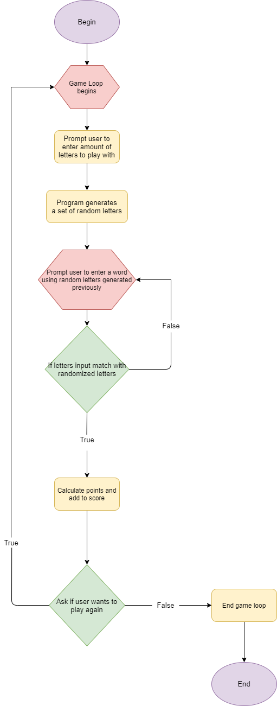
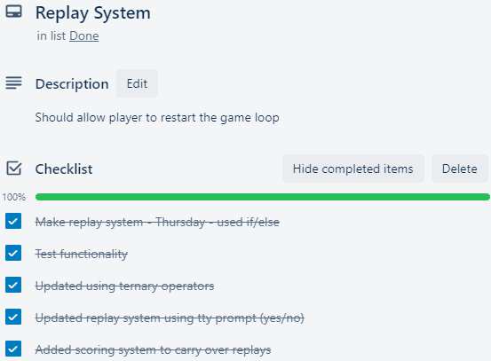
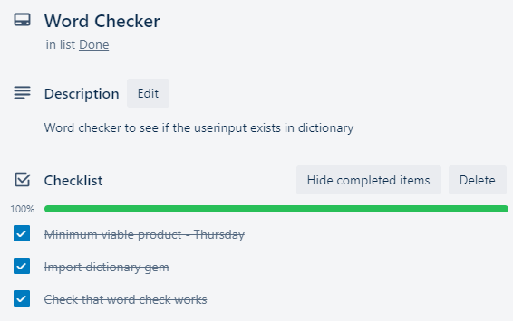
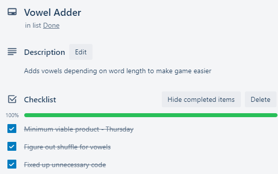
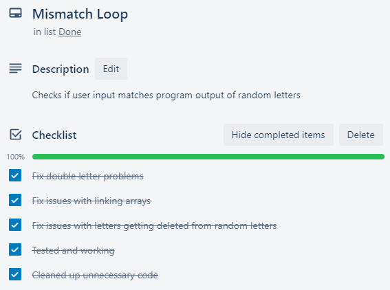
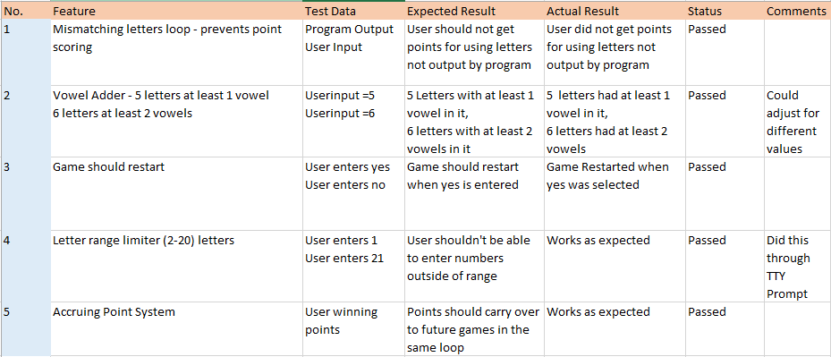

# Terminal Word Scramble

# Software Development Plan

## R3.Referenced Sources
### Gems
https://www.rubydoc.info/gems/tty-prompt
https://github.com/piotrmurach/tty-box
https://rdoc.info/github/fazibear/colorize
https://github.com/nitishparkar/dictionary-lookup-rb
https://github.com/Demonstrandum/RubyFiglet

### Ruby files
Scrabble Hash -
https://exercism.io/tracks/ruby/exercises/scrabble-score/solutions/70afb9275c054c2dab17d7a21da7d408

## R4.Source Control Repository
https://github.com/andrewtrandev/terminalproject

## R5.Purpose and Scope
Program will entertain users by allowing them to play a simple word game in terminal. I'm developing this to test out some programming ideas and features, I also like word games and thought it would be an interesting idea to try.

## Target Audience
The target audience is for bored people looking for brain stimulating entertainment and anyone interested in word games.

## How to use
The target audience will be prompted to enter how many letters they would like to play with.
They will be then given a random set of letters. They will then be prompted to enter a word that uses those random letters. 
If the word uses the letters given, check if it exists in the dictionary, user is given points based on word length.
User is told their final score and amount of games played then asked whether they want to play again. 

## R6.Features
**Replay game** - a while loop that allows you to continue to play again by selecting either yes/no. Limited it to just a menu select for yes/no so that user can't enter other commands and inputs are sanitized. 

**Accruing point system** - points earned will carry over to future games in the instance. Adds the score onto a variable outside the while loop so that the score doesn't get reset each time the game goes through the while loop

**Vowel adder** - if number of letters is greater than 6, add more vowels to make the game easier. Done through a method that first checks
if the word is less than 6 letters and if so will shuffle at least one vowel in, if the word is greater than 6 letters it'll shuffle at least 2 vowels in.
This is done through if/else and shuffling of arrays.

**Mismatching letters loop** - If user inputs letters that don't equal the output randomized letters then continue running a while loop that outputs the random letters and prompts them to input letters that match the output randomized letters. I was initially using delete() but that would delete every instance of a variable and cause errors for words like 'goon'. 
Had to delete the specific letter in the array by referencing it's index using .index and also had to make a different array so that it wasn't deleting the original arrays letters.

**Scrabble hash** - Calculates score using a scrabble hash which values rarer words higher versus the original idea of using length of the word. Downloaded a 3rd party ruby file and used require_relative to access it's functionality.

## R7.User Interaction and Experience
User will be prompted on-screen to enter how many letters they want to play with,
if user tries to enter number outside of the range, display "value is out of expected range 2-20 letters" 
Program then outputs random letters based on userinput.
User will be prompted to enter a word using the randomized letters.
If user's input doesn't exist in randomized letters then display 'Not a valid word' and keep prompting them
to enter letters matching randomized letters.   
If letters used match randomized letters, check if word exists in dictionary.
Award and store points based on scrabble hash. 
Then ask if user wants to play again, user selects from a yes/no menu. 
If user decides to play again, score should carry over and continue to add whilst in the same instance of game loop. 
If user selects no, game ends.

## R8. Control Flow

## R9. Implementation Plan

## R10. Help Documentation
1. Install ruby on your windows subsystem
2. Run Ubuntu 18.04 LTS
3. Download project1.rb file and scrabblescore.rb to same directory
4. Navigate to specified directory using Ubuntu LTS
5. Run project1.rb in Ubuntu LTS by typing in ruby project1.rb

System Requirements: Windows 10, Ubuntu 18.04 LTS, Ruby 2.6.3

## R17. Testing Procedure

